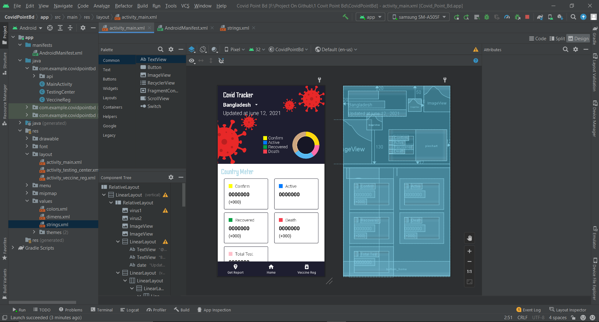
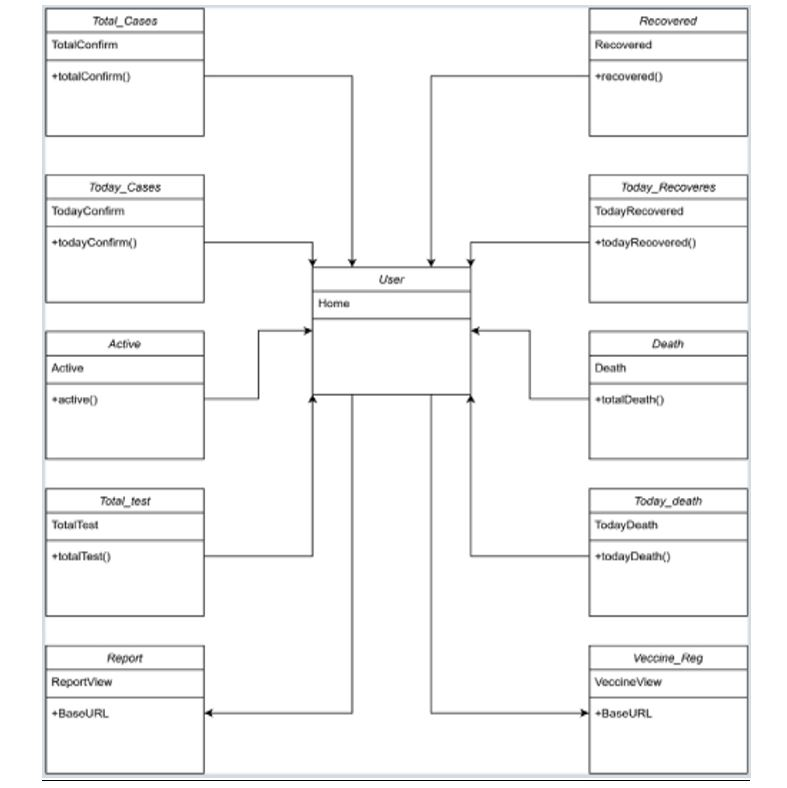
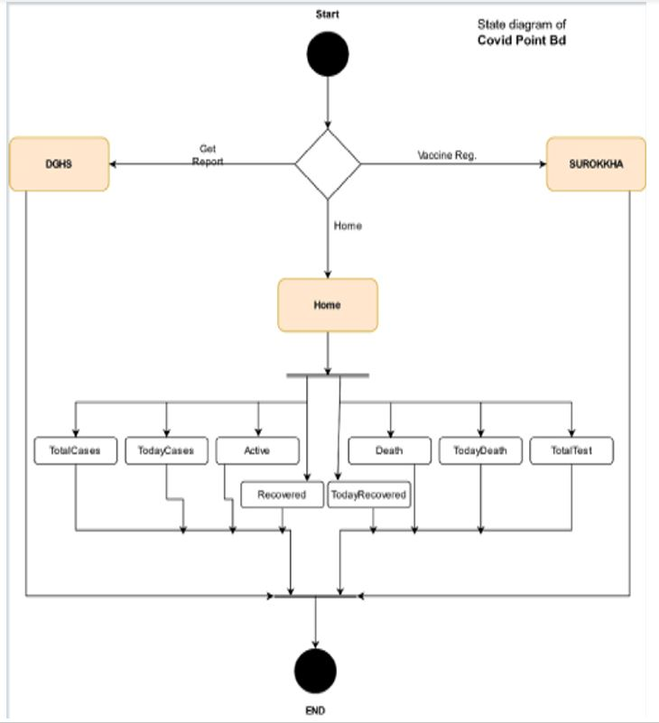
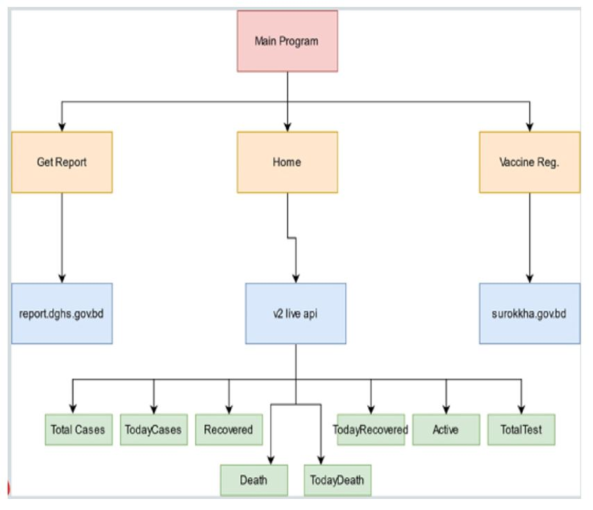
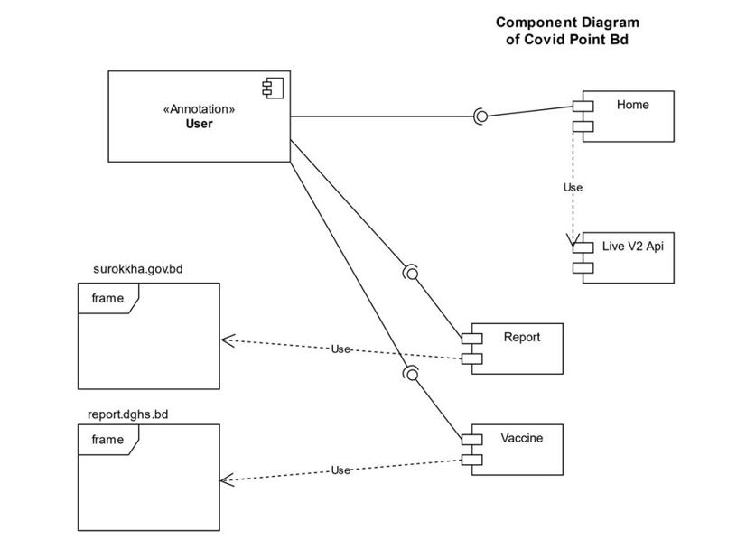

`Shuva Das` 
**`B. Sc.  in CSE`**
---
---

# My apps name is <b>Covid Point Bd.</b>

`#Purpose:`
---
---

It helps people to know the latest updates within a short time by using this app.
First it shows the updates of Bangladesh. (like: <b>Active, Total-cases, death, Recovered, Test </b>etc.) but if we get enough time we add 2 features more such as the <b>Test Report and Vaccine Registration</b>. I add the webview of the original site of Bangladesh for veccine registration and get the test report.
 

 

`#Product Features:`
---
---

•	A User can log in the COVID Tracker BD app with internet connection in any time, and can see the COVID related news anytime. The report or the amount of active and close case updated every moments it’s the important features in our apps. 
•	A user also registers for vaccine by using this app. 
•	A user also gets his/her covid test report by using this app.

 

`#User Class: `
---
---

1. Active();
2. Recovered();
3. Today_Recovered();
4. Death();
5. Today_Death();
6. Total_Test();
7. Cases();
8. Today_Cases();
9. World_Cases();
10. World_Death();
11. World_Recovered();
12. Vaccine_Reg();
13. Get_report();

 

`#Operating Environment: `
---
---

Our app is Android based. It supports in all kind of android device. NO need extra
configuration. It is a very light software. Our app version is available in version 1.0.

 

`#Database : `
---
---

We use world-meter to get the data. We don’t use any custom database. By retrofit2 we retrieve the data from world-meter and show it in our app.

 

`#System Feature :`
---
---

<b>System Feature 1</b> 

<b>System Feature 2</b> 

<b>System Feature 3</b> 

 

`#Use Case Diagram : `
---
---

 

`#Class Diagram : `
---
---

 

`#State Diagram : `
---
---

 

 

`#Architectural Design:  `
---
---

 

`#Component Level Design:  `
---
---

 

 

`#Conclusion:`
---
---

It’s an amazing feeling when it’s work perfectly. Hope it’s help us to conscious about covid situation and we defeat covid-19.  

 

### Team Member

| Name                 | Id                     |
| ------------         | ---------------------- |
| Shuva Das            | CSE 01806736           |
| S.M. Minhajur Rahman | CSE 01806699           |

<!-- all link is here -->
### [Facebook:]
https://www.facebook.com/ShuvaDas.CSE/

[websitelink]: https://github.com/Shuva-Das
[facebooklink]: https://www.facebook.com/ShuvaDas.CSE/

